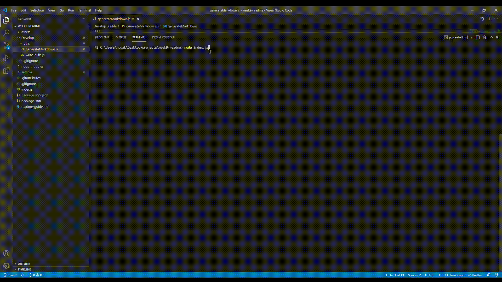

# Readme generator

## Description

Hey welcome to my project help produce a quality README with information about the app you created!
this is a command-line application the runs with Node.js that generates a README file based on the information you tell it about your project.

## table of Contents

- [Installation](#installation)
- [Usage](#usage)
- [Credits](#credits)
- [License](#license)

## installation

To create you own README lets frist start by getting npm up and running use
\`\`\`
npm install
\`\`\`
in the command line.
then download
\`\`\`
inquirer
\`\`\`
which is used to get inputs from the command line in the forms of prompts
you have installed those to start the application
in the command line type \`\`\`node index.js\`\`\` in the command line
after answering all the prompts to generate the READEME which will be called README.MD in the root.

## usage

## license

MIT

## Questions

GitHub: Magicalburritos

Email: hudakjoe@msn.com
